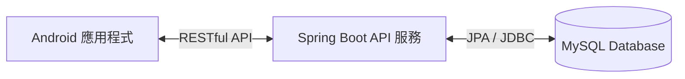

# 📈 股票投資模擬系統 (Stock Investment Simulator)

一個基於 **Spring Boot + MySQL** 雲端後端，搭配 **Android (Java) 行動端** 的前後端分離虛擬股票交易模擬系統。

---

## 📱 行動端 APK 下載 (Download APK)

點選下方按鈕下載最新編譯的 Android 測試版安裝檔：

*(提示：此連結為 GitHub 靜態跳轉網址，將永遠自動下載您在 Release 頁面發布的最新版本 `app-debug.apk`！)*

---

## 🛠️ 專案架構 (Architecture)

### 1. 後端 (SpringToAndroid)
- **核心框架**：Spring Boot 3
- **資料持久化**：Spring Data JPA, Hibernate (啟動時自動比對實體並建表)
- **資料庫**：MySQL 8.0 (運行於 Docker 容器中)
- **雲端主機**：Oracle Cloud VPS (配置 4GB Swap 虛擬記憶體)
- **自動部署**：GitHub Actions CI/CD 自動編譯、打包並部署至伺服器

### 2. 移動端 (Android)
- **開發語言**：Java
- **網路通訊**：Retrofit2 + OkHttp3
- **資料解析**：Gson (自動將統一的 `ApiResponse<T>` JSON 解析為 Java 物件)
- **多環境支援**：本機調試 (`10.0.2.2:8080`) 與 雲端正式版 透過本地隔離設定檔 `islocaltest.properties` 動態切換

---

## 📝 開發進度與計畫 (Roadmap)
- [x] 配置 Oracle 伺服器與 Docker 容器化環境
- [x] 串接 GitHub Actions 自動化編譯與部署
- [x] 設計統一 RESTful JSON 響應標準
- [x] 資料庫表結構自動生成設計 (AppUser, Position, Transaction)
- [ ] 實作後端股票交易邏輯 API (買入、賣出、查詢餘額、查詢持股)
- [ ] 實作 Android 端點擊交易與視覺呈現
