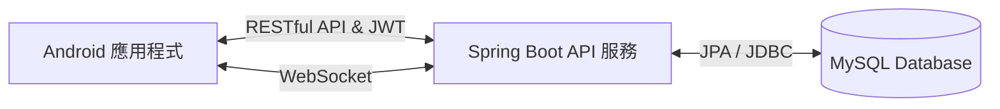

# 📈 股票投資模擬系統 (Stock Investment Simulator)

一個基於 **Spring Boot + MySQL** 雲端後端，搭配 **Android (Java) 行動端** 的前後端分離虛擬股票交易模擬系統。致力於打造最真實、順暢的手機端下單與看盤體驗。

---

## 📱 行動端 APK 下載 (Download APK)

點選下方按鈕下載最新編譯的 Android 測試版安裝檔：

[](https://github.com/Kskaixang/JavaToAndroid/releases/latest/download/app-debug.apk)

*(提示：此連結為 GitHub 靜態跳轉網址，將永遠自動下載您在 Release 頁面發布的最新版本 `app-debug.apk`！)*

---

## ✨ 核心功能特色 (Features)

### 🔐 安全與登入
- **Google OAuth2 快速登入**：無縫串接 Google 帳號授權，一鍵登入。
- **JWT 無狀態驗證**：後端採用 Spring Security + JWT，安全保護所有交易與個資 API，並支援無限多裝置並發登入。

### 📊 專業級動態看盤 (MPAndroidChart)
- **多週期支援**：完美支援 **走勢圖(1分鐘)** 以及 **日線、周線、月線 K線圖**。
- **高自訂圖表引擎**：
  - K線與走勢圖表自適應螢幕，並帶有雙指縮放功能 (Pinch Zoom)。
  - 內建 **MA5 / MA20** 均線顯示。
  - **動態十字指針 (MarkerView)**：長按或滑動圖表時，右側會精準懸浮當前選擇的價格標籤。
- **即時數據**：整合 Yahoo Finance API 即時拉取股票報價與歷史 K 線。

### 💰 虛擬下單與資產管理
- **直覺化交易面板**：
  - 支援 **買進 / 賣出** 以及 **限價 / 市價** 委託。
  - 價格與單位快速加減按鈕 (精確至小數點後兩位 0.01 調整)。
- **即時損益試算**：依照當前市價即時推算該檔股票的未實現損益與報酬率 (%)。
- **庫存與餘額管理**：面板內嵌顯示當前可用餘額與持股數量，並帶有貼心的隱私遮蔽功能 (***)。

---

## 🛠️ 專案架構 (Architecture)



### 1. 後端 (SpringToAndroid)
- **核心框架**：Spring Boot 3
- **安全防護**：Spring Security, JWT Token
- **資料持久化**：Spring Data JPA, Hibernate
- **資料庫**：MySQL 8.0 (Docker 容器化)
- **雲端主機**：Oracle Cloud VPS (配置 4GB Swap 虛擬記憶體)
- **自動部署**：GitHub Actions CI/CD 自動編譯、打包並部署至伺服器
- **即時通訊**：WebSocket 雙向傳輸架構

### 2. 移動端 (Android)
- **開發語言**：Java
- **網路通訊**：Retrofit2 + OkHttp3
- **圖片載入**：Glide
- **資料解析**：Gson (統一處理 `ApiResponse<T>`)
- **圖表套件**：MPAndroidChart v3
- **多環境支援**：開發階段支援 `10.0.2.2` 本機除錯與 `Oracle 雲端` 動態切換 (`islocaltest.properties`)

---

## 📝 開發進度與計畫 (Roadmap)
- [x] 配置 Oracle 伺服器與 Docker 容器化環境
- [x] 串接 GitHub Actions 自動化編譯與部署
- [x] 設計統一 RESTful JSON 響應標準
- [x] 資料庫表結構自動生成設計 (AppUser, Position, Transaction)
- [x] 實作 Google OAuth2 登入與 JWT 授權機制
- [x] 實作高質感深色模式下單面板與動態 K 線圖 (MPAndroidChart)
- [x] 優化十字指針與價格高亮連動，修復極端環境下的座標遺失問題
- [x] 實作後端股票交易邏輯 API (買入、賣出、查詢餘額、查詢持股)
- [ ] 委託回報與帳務明細歷史頁面實作

---

### ⚠️ 開發者小叮嚀
若要將 App 安裝至實機並連線至雲端伺服器，請務必確認 `app/` 目錄下的 `islocaltest.properties` 設為：
```properties
is.local.test = false
```
*(若未設定，實體手機將預設連線至本地虛擬機 IP `10.0.2.2`，導致網路連線 Timeout！)*
